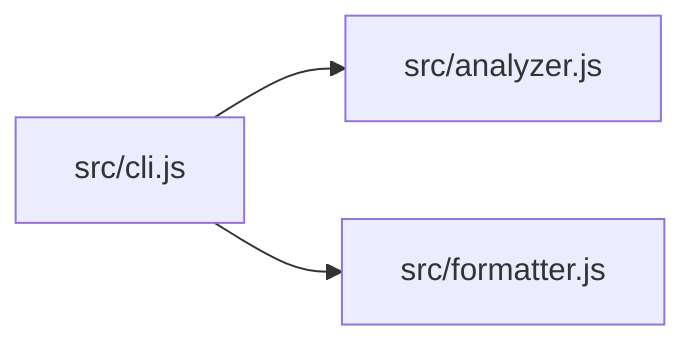

# codemap

A CLI tool that generates a structural overview of your codebase. Think of it as a smart `tree` that understands code — it identifies languages, extracts function signatures, and shows you what's inside each file.

## Install

```
npx codemap-gen
```

Or install globally:

```
npm install -g codemap-gen
```

## Usage

```
codemap [directory] [options]
```

### Options

| Flag | Description |
|------|-------------|
| `-s, --summary` | Show summary statistics only |
| `-m, --markdown` | Output as Markdown |
| `-j, --json` | Output as JSON (pipeable) |
| `-g, --graph` | Output dependency graph as Mermaid |
| `-d, --max-depth N` | Maximum directory depth |
| `-i, --ignore` | Additional ignore patterns (comma-separated) |
| `--no-gitignore` | Don't read .gitignore |
| `-h, --help` | Show help |

### Examples

```bash
# Analyze current directory
codemap

# Quick summary of a project
codemap ./my-project -s

# Export structure as Markdown
codemap -m > CODEMAP.md

# Shallow view (root + one level)
codemap -d 1

# Ignore test files
codemap -i "*.test.js,*.spec.ts"
```

## What it detects

**Languages:** JavaScript, TypeScript, Python, Go, Rust, C/C++, Java, Kotlin, Ruby, Shell, and 30+ more.

**Signatures:** Functions, classes, methods, structs, interfaces, traits. Marks exported symbols. Supports JS/TS, Python, Go, Rust, C/C++, Java, Kotlin, Ruby, and Shell.

**Imports:** Extracts import/require/use/include statements. Supports JS/TS, Python, Go, Rust, and C/C++.

**Smart defaults:** Ignores `node_modules`, `.git`, `dist`, `build`, `__pycache__`, and other common directories. Reads `.gitignore` automatically.

## Output modes

### Tree (default)

```
my-project/
├─ package.json (JSON, 26L)
└─ src/
   ├─ index.js (JavaScript, 45L)
   │    ⬡ function main:12
   │    ⬡ function parseArgs:30
   └─ utils.js (JavaScript, 20L)
       function helper:5

──────────────────────────────────────
📁 /path/to/my-project
   3 files, 1 directories
   91 lines, 4.2 KB

Languages:
  ████████████████████████████████████ JavaScript 100.0% (65 lines)
```

### Summary (`-s`)

Quick statistics: file count, line count, size, language breakdown.

### Markdown (`-m`)

Structured Markdown with tables — useful for documentation or READMEs.

### JSON (`-j`)

Full analysis data as JSON — pipe to `jq`, feed to scripts, or integrate with other tools.

```bash
codemap -j | jq '.languages'
codemap -j | jq '.files[] | select(.signatures | length > 0) | .name'
```

### Dependency graph (`-g`)

Outputs a Mermaid diagram of internal file dependencies. Renders directly on GitHub.

```bash
codemap -g > DEPS.md
```



## Zero dependencies

No runtime dependencies. Pure Node.js (>=18). ~600 lines of code.

## License

MIT
